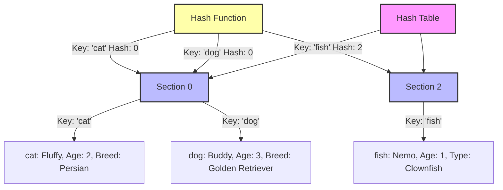

## Install Dependencies
```bash
npm start
```

### Test 
```bash
node main.js
```


```mermaid
graph TD
    A[Hash Table]
    H[Hash Function]

    %% Sections
    B[Section 0]
    D[Section 2]

    %% Hash Function connections with hashes
    H --> |"Key: 'cat' Hash: 0"| B
    H --> |"Key: 'dog' Hash: 0"| B
    H --> |"Key: 'fish' Hash: 2"| D

    %% Connections to Sections
    A --> B
    A --> D

    %% Values in Sections
    B --> |"Key: 'cat'"| C[cat: Fluffy, Age: 2, Breed: Persian]
    B --> |"Key: 'dog'"| E[dog: Buddy, Age: 3, Breed: Golden Retriever]
    D --> |"Key: 'fish'"| F[fish: Nemo, Age: 1, Type: Clownfish]

    %% Styles for better visuals
    style A fill:#f9f,stroke:#333,stroke-width:2px
    style H fill:#ffa,stroke:#333,stroke-width:2px
    style B fill:#bbf,stroke:#333,stroke-width:2px
    style D fill:#bbf,stroke:#333,stroke-width:2px

```